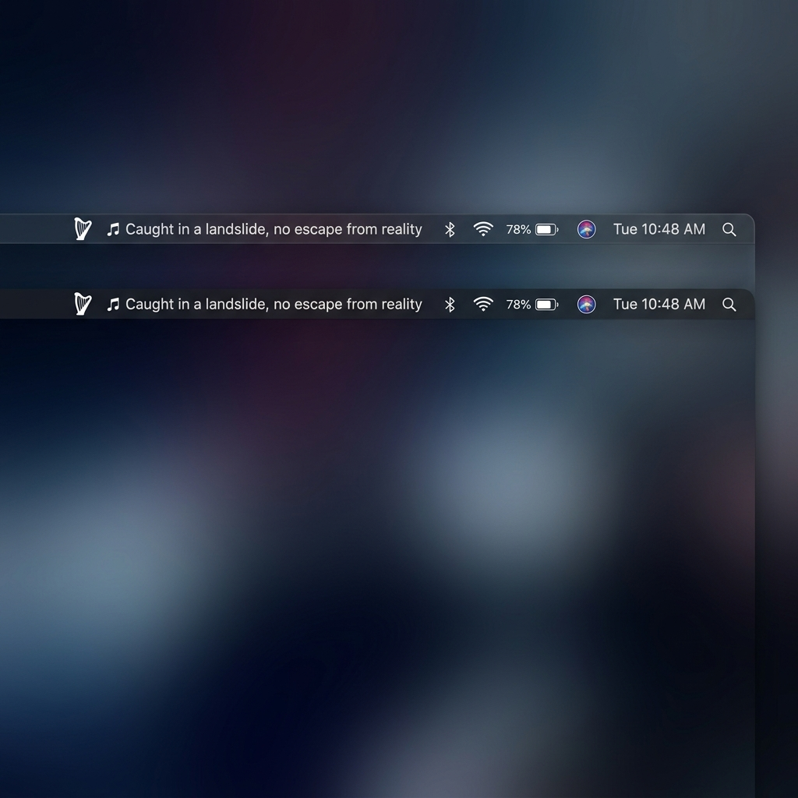

# Lyra 

Lyra is a macOS-only (for now) menu bar application that displays real-time, synchronized scrolling lyrics for the track currently playing in the Spotify or Apple Music desktop applications.
---

## Menu Bar Preview



---


## Installation

Lyra can be installed either as a standard macOS application bundle (recommended for most users) or as a command-line binary.

### Method 1: Package as a macOS App Bundle (Recommended)

Packaging Lyra as a `.app` bundle enables a visual setup onboarding screen, requests macOS system permissions gracefully, and registers the app to launch automatically when you log in.

1. **Clone the repository:**
   ```bash
   git clone https://github.com/Dai-Ski/LYRA.git
   cd LYRA
   ```
2. **Run the packaging script:**
   ```bash
   ./Scripts/package.sh
   ```
   This compiles the binary in release configuration and structures it into a standalone `Lyra.app` bundle in the repository root.
3. **Move to Applications:**
   Drag `Lyra.app` to your `/Applications/` folder:
   ```bash
   mv Lyra.app /Applications/
   ```
4. **Launch and Complete Setup:**
   - Double-click **Lyra** in your Applications folder to run it.
   - A boxy, frosted-glass setup window will appear. Click **GRANT PERMISSIONS & START**.
   - macOS will prompt you to allow Lyra to control Spotify and Apple Music. Accept these permissions so Lyra can read track metadata.
   
> [!NOTE]
> Once setup is completed, Lyra runs silently in the background. It will automatically appear in your top menu bar whenever Spotify or Apple Music is active, and hide itself when they are closed.

---

### Method 2: Command-Line Binary (For Developers)

If you prefer running Lyra directly from the terminal as a background daemon:

1. **Clone the repository & build:**
   ```bash
   git clone https://github.com/Dai-Ski/LYRA.git
   cd LYRA
   swift build -c release
   ```
2. **Install the binary:**
   Copy the compiled binary into your system execution path:
   ```bash
   sudo cp .build/release/Lyra /usr/local/bin/lyra
   ```
3. **Verify installation:**
   ```bash
   lyra --version
   ```
4. **Run Lyra:**
   Ensure Spotify or Apple Music is playing a track, then launch the daemon:
   ```bash
   lyra
   ```
   *Optional CLI Arguments:*
   * `--interval <seconds>`: Override polling frequency (default: `2.0` seconds).
   * `-d`, `--debug`: Enable verbose debug logging to print track updates and raw lyrics search queries.

---

## Uninstall

### To Uninstall the macOS App Bundle

1. Click on the Lyra menu bar icon (or click the active lyric) and select **Quit Lyra**.
2. Open your `/Applications/` folder and drag **Lyra.app** to the Trash (or run `rm -rf /Applications/Lyra.app`).
3. (Optional) Disable automatic startup:
   - Go to **System Settings > General > Login Items & Extensions**.
   - Under **Open at Login**, locate **Lyra** and toggle it off (or click the `-` button to remove it).

### To Uninstall the CLI Binary

1. Terminate any active background instances of Lyra:
   ```bash
   killall Lyra
   ```
2. Remove the binary from your execution path:
   ```bash
   sudo rm /usr/local/bin/lyra
   ```

---

## Future

I plan to expand Lyra's capabilities to more music sources, platforms, and integrations:

1. [x] Apple Music
2. [ ] YouTube Music
3. [ ] Browser Extension
4. [ ] Windows Taskbar

